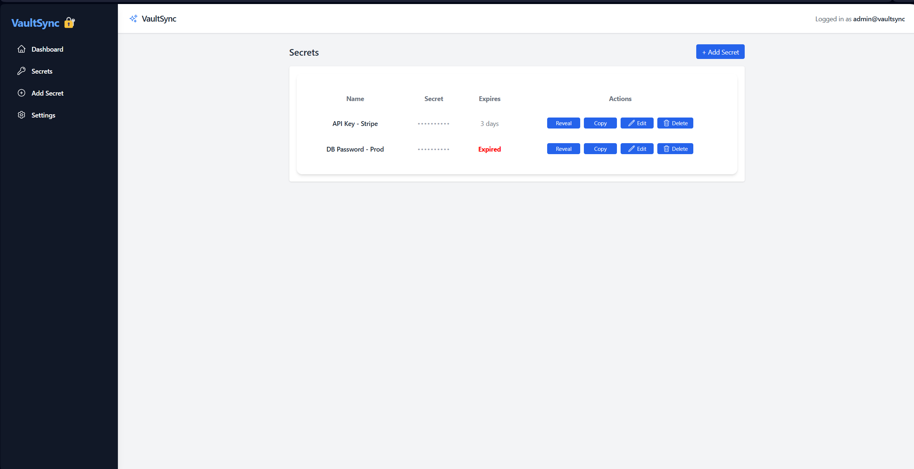

# VaultSync 🔐

A secure and beautifully designed secret manager built with **React + TypeScript**, powered by **Vite** and styled with **TailwindCSS**.

## ✨ Features

- Add, edit, reveal, and delete secrets
- Responsive dashboard layout
- Expired secrets shown in red
- Heroicons integrated for actions
- Modal-based forms for a clean UX

## 🛠️ Tech Stack

- [React](https://reactjs.org/)
- [TypeScript](https://www.typescriptlang.org/)
- [TailwindCSS](https://tailwindcss.com/)
- [Vite](https://vitejs.dev/)
- [Heroicons](https://heroicons.com/)

## 🚀 Getting Started

```bash
# Clone the repository
git clone https://github.com/Roy-Cheong/vaultsync-frontend.git

# Install dependencies
cd vaultsync-frontend
npm install

# Run the dev server
npm run dev
```

## 🧾 Project Structure

```bash
vaultsync-frontend/
├── src/
│   └── components/layout
├── index.html
├── package.json
├── tailwind.config.js
├── postcss.config.js
├── vite.config.ts
├── tsconfig.json
├── .gitignore
└── README.md
```

## 📸 Preview
```md

```

## 📦 Build

```bash
npm run build
```

## 🧠 Author

Made with 💙 by [Roy Cheong]
```