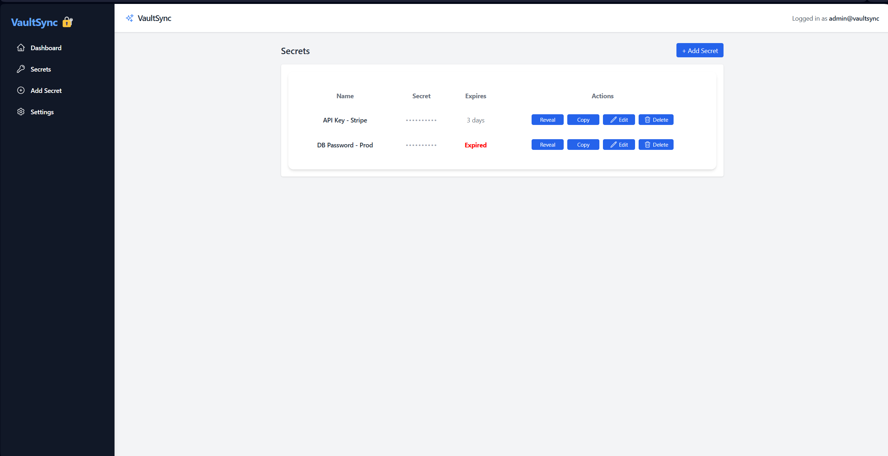

# VaultSync – Secure Secrets Manager (Frontend)

VaultSync is a modern, secure, and intuitive frontend for managing sensitive secrets and credentials.  
Built with **React**, **TypeScript**, **Vite**, and **TailwindCSS** for lightning-fast performance and clean, responsive UI.

---

## 🚀 Features

- 🔐 **Create, Edit, Delete Secrets** — Full live update table
- 👁️‍🗨️ **Reveal/Hide Secret Values** securely
- 📋 **Copy Secret to Clipboard** in one click
- 🕑 **Expiration Tracking** (with "Expired" status highlighting)
- 📱 **Fully Responsive UI** (Desktop + Mobile)
- 🎨 **Modern Design** powered by TailwindCSS
- ⚡ **Blazing Fast** build using Vite

---

## 🛠 Tech Stack

- [React](https://react.dev/) (Frontend Framework)
- [TypeScript](https://www.typescriptlang.org/) (Static Typing)
- [Vite](https://vitejs.dev/) (Development & Build Tool)
- [TailwindCSS](https://tailwindcss.com/) (UI Styling)
- [Heroicons](https://heroicons.com/) (Beautiful Icon Set)

---

## 📦 Getting Started

### 1. Clone the Repository

```bash
git clone https://github.com/Roy-Cheong/vaultsync-frontend.git
cd vaultsync-frontend
```

### 2. Install Dependencies

```bash
npm install
```

### 3. Run Development Server

```bash
npm run dev
```

The app will start on [http://localhost:5173](http://localhost:5173) 🚀

---

## 🖥️ Screenshots

| Dashboard View  |
|:---------------:|
|  |

---

## 📄 License

This project is licensed under the [MIT License](LICENSE).

---

## 🤝 Coming Soon

- Backend API Integration (VaultSync API)
- Real database connection for secrets storage
- Authentication and User Management
- Full Deployment on Render / Vercel
```
